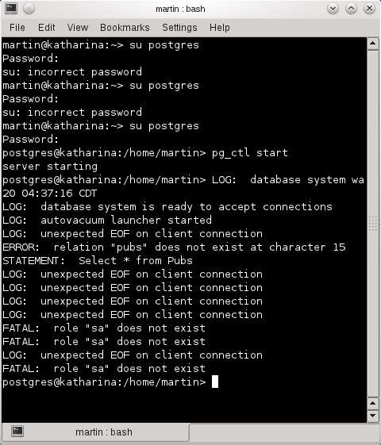

# Uso de custom exceptions en aplicaciones GTK# con Monodevelop

Hace unos días publiqué una entrada que mostraba el uso de excepciones personalizadas y como ejemplo de esa técnica un proyecto de consola de MonoDevelop que obtenía registros de una tabla en una base de datos PostgreSQL, derivado de ese ejemplo hice una aplicación en GTK# la cual muestra los mismos conceptos pero ahora con un formulario gráfico, por lo que hice algunas modificaciones con respecto al proyecto de consola de manera que pueda entenderse de una mejor manera.
Los pasos son:

1.Ejecutamos MonoDevelop y creamos un proyecto GTK# llamado GtkPostException

2.Descargamos y descomprimimos el código del ejemplo de excepciones de este enlace.

3.Con el botón derecho encima del icono de la solución agregamos las siguientes clases a la solución.

<pre>
<ul>
<li>Book.cs</li>
<li>BooksDataManager.cs</li>
<li>DataBaseException.cs</li>
<li>Logger.cs</li>
<li>RuntimeException.cs</li>
</ul>
</pre>

4.Una vez agregadas las clases a la solución verificamos y en su caso editamos para que cada clase se agrupe dentro del namespace GtkPostException.

5.Creamos un formulario con dos controles label, un control TextView (en donde teclearemos la Connection String), un control Treeviewdonde mostramos el resultado de la consulta y un botón de manera que el formulario tenga el aspecto visual de la siguiente imagen:

Cambiamos el código de la clase BooksDataManager en el método SelectAll para que reciba un parámetro string con el valor de la Connection String recibida desde la interfaz de usuario. Aquí el listado completo de la clase:

<b>Listing 1. La clase para acceso a datos.</b>

7.Agregamos al evento Clicked del Botón el metodo ExecuteQuery, cuyo código se muestra a continuación:

<b>Listing 2. Evento del botón executeQuery.</b>
<pre>
protected virtual void ExecuteQuery (object sender, System.EventArgs e)
{
    try
    {
        AddColumns(GridOutput);
        GridOutput.Model = CreateModel();
        lbmsg.Text += "Consulta ejecutada";
    }
    catch(GtkPostException.DataBaseException ex)
    {
        MessageBox(ex.Message);
    }
    catch(GtkPostException.RuntimeException ex)
    {
        MessageBox(ex.Message);	
    }
}
</pre>

Si se compila correctamente al ejecutar la aplicación veremos una pantalla como la siguiente imagen:

Al presionar el botón OK mostrará los registros de la tabla conforme a la consulta, como en la siguiente imagen.

Hasta aquí el flujo normal de la aplicación o happy path,ahora vamos a ocasionar una excepción reemplazando el usuario <i>postgres</i> por el usuario sa el cual no existe en la base de datos hecho esto presionamos el botón para que se muestre la excepción personalizada en un cuadro de dialogo, esta excepción queda a nivel base de datos de ahí que lance una DataBaseException.

Este tipo de excepciones son registradas por <b>PostgreSQL</b> si el proceso del servidor se ejecutó desde una terminal como en la siguiente imagen:

Para generar la excepción a nivel aplicación en vez del valor de la Connection String tecleamos cualquier cadena no válida con lo que al presionar el botón nos mostrará el mensaje referente a la clase <tt>RuntimeException</tt> como en la siguiente imagen:

El detalle a nivel técnico de las excepciones originales se podrá consultar en el archivo log.txt el cual por lo general no es accesible al usuario final sino únicamente al personal técnico.

